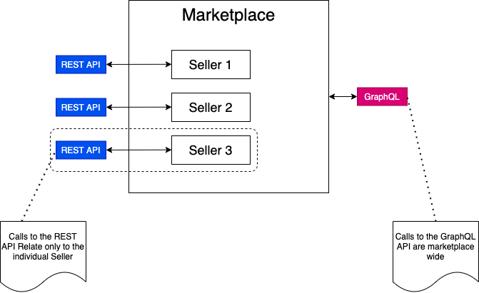

# v2 API Overview

## Why would I choose this API?

The v2 (REST) API is focused at the Seller level and is used for tasks including, but not limited to:

- Creating Products (Adverts) on the Seller’s Marketplacer store
- Retrieving Invoices for sales the Seller has made
- Getting and setting stock levels
- Creating, updating, and retrieving shipments

> **Note:** if you’re the marketplace operator and need overarching access to _**all seller**_ data on the marketplace, as well as marketplace specific data, (i.e. data that is not available to your individual sellers), then you should probably be using our GraphQL API!

A contextual overview of how the v2 API differs from the GraphQL API is shown below:

 

## Other Stuff...